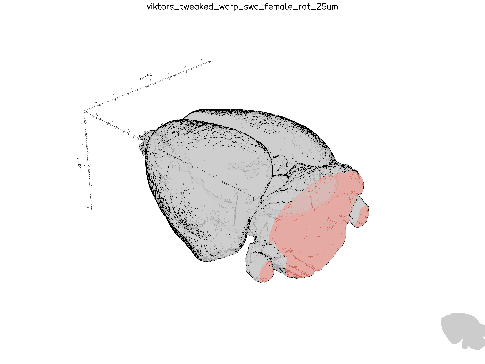
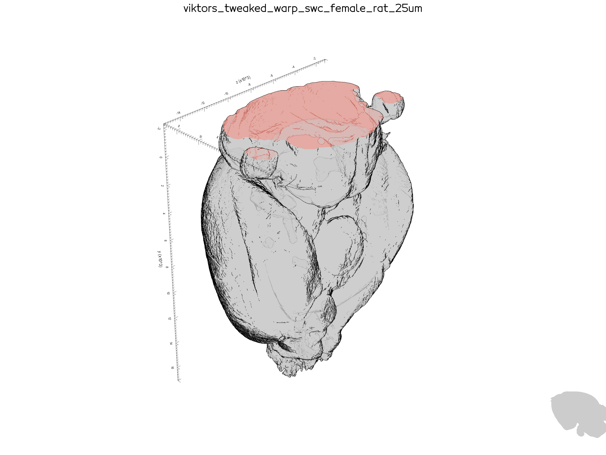

# Visualization scripts

Python tools for exploring atlas geometry and batch-rendering brainreg subjects.
Run all commands from the **`workflows` repo root** (so `bg_viz_pipeline` is importable).

Requires a BrainGlobe conda env (e.g. `brainglobe-env`).

## Quick comparison

| Script | Input | Output | Use when |
|--------|-------|--------|----------|
| [`render_atlas.py`](render_atlas.py) | Config block at top of file | Interactive window (+ optional PNG) | Tuning slice, camera, pose on the atlas alone |
| [`brainreg_viewer.py`](brainreg_viewer.py) | [`presets/viewer_presets.json`](../presets/viewer_presets.json) | One PNG per preset | Batch figures with probes + regions for real subjects |
| [`probes_to_html.py`](probes_to_html.py) | CLI args | Interactive HTML | Shareable 3D probe view in a browser |

Preset field reference: [`presets/README.md`](../presets/README.md).

---

## `render_atlas` — interactive atlas explorer

Edit the configuration block at the top of [`render_atlas.py`](render_atlas.py), then:

```bash
python -m bg_viz_pipeline.scripts.render_atlas
```

### Three independent controls

Think of three dials you tune separately:

1. **Pose** (`SUBJECT_POSE`) — how the specimen is mounted (rotates mesh geometry).
2. **Camera** (`CAMERA_*`) — where you stand in the room (fixed world viewpoint).
3. **Slice** (`SLICE_MODE`, `PLANE_DEPTH`, …) — where you cut (normal rotates with pose).

Pose and camera are **intentionally separate**: changing pose moves the brain, not the camera. Re-tune camera after changing pose if the view no longer makes sense.

### Configuration reference

| Variable | Values / type | What it does |
|----------|---------------|--------------|
| `MESH_MODE` | `"root"` \| `"regions"` | Whole-brain shell vs atlas regions |
| `REGION_MODE` | `"leaves"` \| `"all"` | Which regions when `MESH_MODE == "regions"` |
| `SUBJECT_POSE` | `"on_base"` \| `"on_bulb"` \| `"on_side"` | Specimen mounting |
| `CAMERA_DISTANCE_FACTOR` | float | Zoom (larger = farther) |
| `CAMERA_ROTATION_DEG` | float | Orbit left/right |
| `CAMERA_ELEVATION_DEG` | float | Camera tilt along atlas y (see [Atlas coordinates](#atlas-coordinates)) |
| `_BASE_FRONTAL_AZIMUTH_DEG` | float | What “rotation = 0” means for this atlas |
| `SLICE_MODE` | `"none"`, `"frontal"`, `"horizontal"`, `"sagittal"`, `"custom"` | Cut plane |
| `PLANE_DEPTH` | 0–1 | Position along normal (`0` = one extreme, `1` = other) |
| `CUSTOM_PLANE_NORMAL` | `(x, y, z)` | Direction when `SLICE_MODE == "custom"` |
| `CLOSE_ACTORS` | bool | `False` = open cut; `True` = solid cap |
| `SLICE_CAP_COLOR` | colour name or `None` | Cap colour when `CLOSE_ACTORS` is True |
| `PLOTTER_AXES` | int | vedo axes mode (`0` = off, `8` = labelled x/y/z) |

BrainGlobe axis names for this atlas: frontal **+x**, horizontal **+y**, sagittal **+z**.

### Atlas coordinates

Camera and slice knobs use **atlas/world coordinates**, not “up in the room”. For
`viktors_tweaked_warp_swc_female_rat_25um` the plotted **y axis points downward**
(y tick numbers increase toward the bottom of the window). The origin sits near
the dorsal/top edge of the volume, so most of the brain lies at positive y.

`CAMERA_ELEVATION_DEG` moves the eye along that y axis. Tune by eye — do not
assume it matches intuitive above/below.

To see the axis numbers yourself, set `PLOTTER_AXES = 8` in `render_atlas.py`
(vedo cube axes on the bounding box).

Same camera settings, different pose — axes stay fixed in atlas space; only the
mesh rotates:



*SUBJECT_POSE = `"on_base"`*



*SUBJECT_POSE = `"on_bulb"`*

### Suggested workflow

1. Set `SUBJECT_POSE`.
2. Adjust `CAMERA_*` until the view looks right.
3. Set slice mode and `PLANE_DEPTH`.
4. Note the values that worked (or copy them into a preset — see below).

### Cookbook (starting points)

Tune by eye; these are reasonable first guesses:

**On base, oblique frontal**

```python
SUBJECT_POSE = "on_base"
CAMERA_DISTANCE_FACTOR = 4.0
CAMERA_ROTATION_DEG = -45.0
CAMERA_ELEVATION_DEG = -30.0
_BASE_FRONTAL_AZIMUTH_DEG = 0.0
SLICE_MODE = "custom"
CUSTOM_PLANE_NORMAL = (-1.0, 0.0, 0.0)  # frontal-ish
PLANE_DEPTH = 0.4
```

**On bulb (nose down)** — same camera, different mount:

```python
SUBJECT_POSE = "on_bulb"
# re-tune CAMERA_* as needed
```

If a pose looks flipped, edit angles in [`lib/pose_helpers.py`](../lib/pose_helpers.py) (`POSE_ROTATIONS_DEG`).

### Screenshots

With `SLICE_MODE == "custom"`, recognised normals write `atlas_screenshot_<mode>_<view>.png` in the current directory after you close the window.

---

## `brainreg_viewer` — batch PNG export

Renders registered subjects with atlas regions, probe tracks, optional custom `.obj` regions, and brainmapper cells. Settings come from JSON presets.

1. Edit [`presets/viewer_presets.json`](../presets/viewer_presets.json) (see [`presets/README.md`](../presets/README.md)).
2. Set `BASE_DIR` in [`brainreg_viewer.py`](brainreg_viewer.py) to your data root if needed.
3. Run:

```bash
python -m bg_viz_pipeline.scripts.brainreg_viewer
python -m bg_viz_pipeline.scripts.brainreg_viewer --only-subject ROI-1
python -m bg_viz_pipeline.scripts.brainreg_viewer --only-subdir ds_MPX-R-0033
```

Output PNGs are written to the current directory. Filenames encode subject, camera, and slice settings (e.g. `sub-MPX-R-0033_dist-4.00_rot--45.0_el--15.0.png`).

**Note:** `brainreg_viewer` uses a fixed frontal azimuth of `180°` internally. `render_atlas` uses `_BASE_FRONTAL_AZIMUTH_DEG` from its config block — the same `CAMERA_ROTATION_DEG` may not match visually between the two scripts until you align those bases.

**Pose:** `SUBJECT_POSE` is only in `render_atlas` today. To batch-render with pose, add the field to presets and wire it in `brainreg_viewer` (same order as `render_atlas`: pose → camera → slice).

### Expected subject layout

```
<brainreg_dir>/
  segmentation/atlas_space/tracks/*.npy    # required (at least one)
  segmentation/atlas_space/regions/*.obj   # optional
  brainmapper/points/points.npy            # optional
```

---

## `probes_to_html` — interactive HTML export

```bash
python -m bg_viz_pipeline.scripts.probes_to_html \
  <atlas_name> \
  <brainreg_dir> \
  <output.html> \
  --regions M2 VLO LO
```

See the module docstring in [`probes_to_html.py`](probes_to_html.py) for full options.

---

## Advanced (library code)

| Module | Role |
|--------|------|
| [`lib/camera_helpers.py`](../lib/camera_helpers.py) | Spherical camera from bounds + azimuth/elevation |
| [`lib/pose_helpers.py`](../lib/pose_helpers.py) | Rigid mesh rotation and slice-normal rotation |
| [`lib/styles.py`](../lib/styles.py) | Shared colours/alpha for `brainreg_viewer` |

You do not need these for day-to-day tuning — only when changing how the helpers work or fixing a flipped pose.
